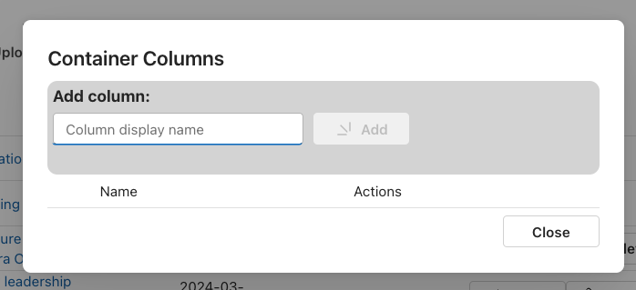
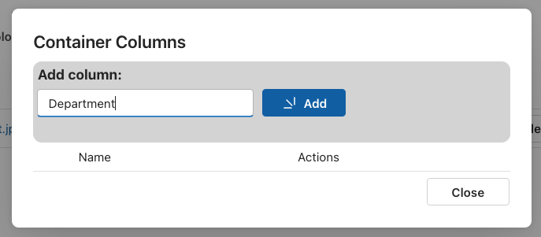
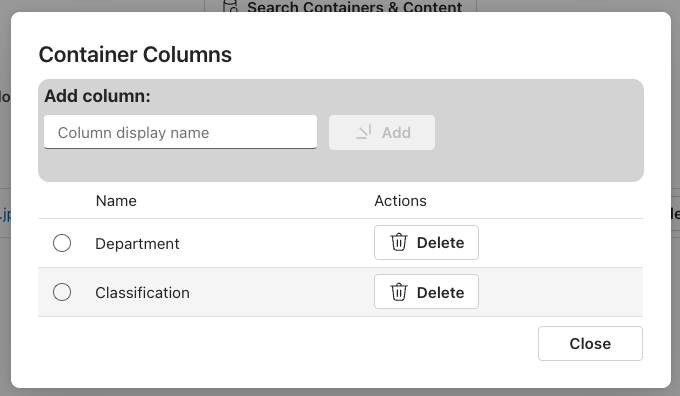
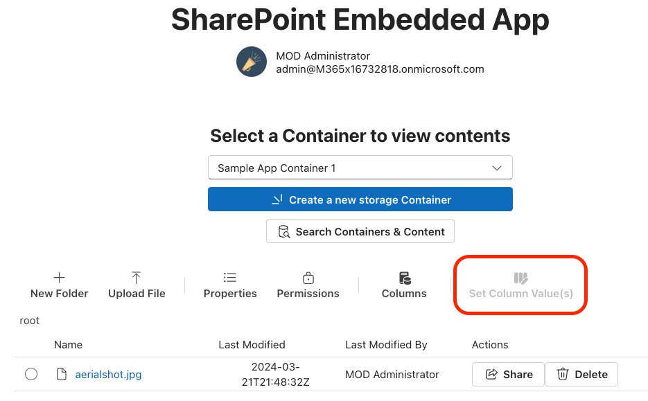
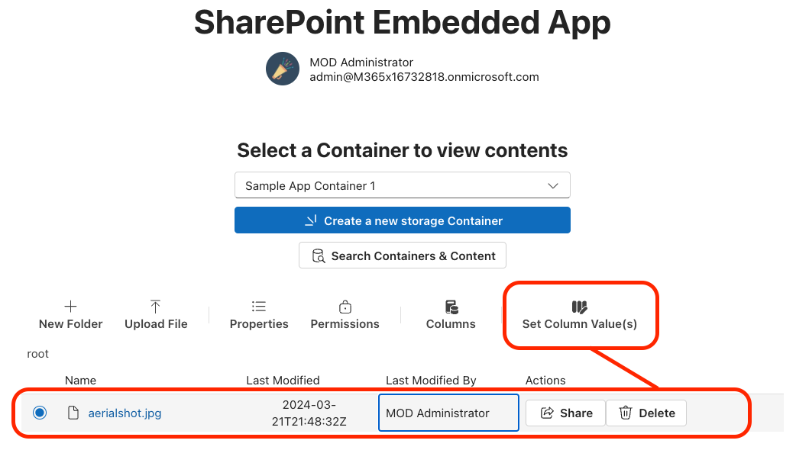
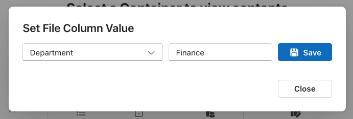

# Lab 04 - Populate custom metadata on files with AI extracted fields

In this hands-on lab, you'll add the ability to manage the schema of SPE Containers as well as enabling users to set the metadata on files using the new metadata schema. For those familiar with SharePoint's Document Libraries, you can think of this process similar to that of adding a column to a Document Library.

The metadata added to files within the Container using your new columns is accessible throughout Microsoft 365, provided Microsoft 365 content discovery is enabled. This includes using the metadata column values in search filtering criteria (as covered in a previous lab) and Copilot for Microsoft 365.

> [!IMPORTANT]
> This lab assumes you are working with the existing server-side API & React SPA projects found in the [sample-app/03-checkpoint](../sample-app/03-checkpoint/) folder. This is the final project from completing lab 03.
>
> **If you elect to start from the checkpoint instead of using the project you were updating in th e previous lab, remember to first install all the project's dependencies by running the `npm install` command in the root of the project. You'll also need to update the following files in the project with the relevant IDs and secrets for your specific SharePoint Embedded & Microsoft Entra application:**
>
> - ./.env
> - ./server/common/config.ts
> - ./src/common/config.ts
>
> At the end of this lab, your project should mirror the functionality in the projects found in the [sample-app/04-checkpoint](../sample-app/04-checkpoint/) folder. If you have trouble along the way, refer to that project for the working sample.

## Manage the Container metadata schema

Before we can give the users of our SPE app the ability to add metadata to files within the Container, we need to give them the ability to manage the columns within the Container. In this exercise, that's what we'll tackle first. You'll start by creating a new dialog and wiring it up to the app's UX to add and remove columns from the currently selected Container.

### Create the Container column manager dialog

Start by creating a new React component, **./src/components/dialogs/ContainerColumns.tsx** and add the following import statements to it:

```typescript
import { useState, useEffect } from "react";
import {
  NewFilled,
  DeleteRegular
} from "@fluentui/react-icons";
import {
  Button, Input, Text, Spinner,
  Dialog, DialogActions, DialogContent, DialogBody, DialogSurface, DialogTitle,
  DataGrid, DataGridHeader, DataGridHeaderCell, DataGridBody, DataGridRow, DataGridCell,
  TableColumnDefinition, TableCellLayout, TableRowId, createTableColumn,
  SelectionItemId,
  makeStyles, shorthands
} from "@fluentui/react-components";
import { Providers } from "@microsoft/mgt-element";
import { ColumnDefinition } from "@microsoft/microsoft-graph-types-beta";
```

Now add some basic scaffolding to the component to define styles you'll use in the rendering, the component's public signature, and the basic structure of the component:

```tsx
const useStyles = makeStyles({
  addFormContainer: {
    ...shorthands.borderWidth('2px'),
    ...shorthands.borderRadius('10px'),
    ...shorthands.padding('5px'),
    backgroundColor: 'lightgray',
  },
  addForm: {
    display: 'flex',
    flexDirection: 'row',
    columnGap: '10px',
    ...shorthands.margin('5px', '0px', '25px')
  },
  inputBox: {
    width: '250px'
  }
});

export interface IDialogContainerColumnsProps {
  isOpen: boolean;
  containerId: string;
  onClose?: () => void;
}

export const DialogContainerColumns = (props: IDialogContainerColumnsProps) => {

  //TODO - grid columns

  const styles = useStyles();

  return ();
}
```

### List the existing Container's columns

With the skeleton of the component created, let's now implement the listing of the columns in the Container. For this, we're only interested in listing columns that our users have created, not the system-generated columns, because we don't want users deleting the system-generated columns.

Start by adding the following state variables ot the **DialogContainerColumns** component immediately after it's declaration:

```typescript
const [containerColumns, setContainerColumns] = useState<ColumnDefinition[]>([]);
const [selectedRows, setSelectedRows] = useState<Set<SelectionItemId>>(new Set<TableRowId>([1]));
```

Next, add a side effect so that when either the component's `containerId` or `isOpen` property change, it will call a method to get all the columns for the currently selected Container:

```typescript
useEffect(() => {
  (async () => {
    if (props.containerId && props.isOpen) {
      await loadColumns();
    }
  })();
}, [props.containerId, props.isOpen]);
```

Now add a method `loadColumns()` that will retrieve all the Container's columns that weren't created by the system. We'll check the column's internal name against an existing static list in our code. To get the columns on a Container, use the Microsoft Graph's `/storage/fileStorage/containers/{{id}}/columns` endpoint. The response is filtered to only keep the columns that don't have an internal name matching one of our filtered system column names:

```typescript
const loadColumns = async () => {
  const graphClient = Providers.globalProvider.graph.client;
  const graphResponse = await graphClient.api(`/storage/fileStorage/containers/${props.containerId}/columns`)
  .version('beta')
  .get();

  const SystemColumns = new Set(['ID', 'Created', 'Author', 'Modified', 'Editor', '_CopySource', 'FileLeafRef', 'FileSizeDisplay', 'Title', '_ExtendedDescription']);
  const containerColumns: ColumnDefinition[] = graphResponse.value.filter((column: ColumnDefinition) => !SystemColumns.has(column.name!));
  setContainerColumns(containerColumns || []);
};
```

Add two more state variables after the existing ones you previously added to the component to track the working status of the dialog:

```typescript
const [isAdding, setIsAdding] = useState(false);
const [isDeleting, setIsDeleting] = useState(false);
```

The dialog will use a **DataGrid** to display the list of columns like we've used throughout the app. First, define the columns and their sizing by replacing the comment `//TODO - grid columns` with the following code:

```tsx
const columns: TableColumnDefinition<ColumnDefinition>[] = [
  createTableColumn({
    columnId: 'name',
    renderHeaderCell: () => {
      return 'Name'
    },
    renderCell: (containerColumn) => {
      return (
        <TableCellLayout>
          {containerColumn.displayName || containerColumn.name}
        </TableCellLayout>
      )
    }
  }),
  createTableColumn({
    columnId: 'actions',
    renderHeaderCell: () => {
      return 'Actions'
    },
    renderCell: (column) => {
      return (
        <>
          <Button aria-label="Delete"
            disabled={isAdding || isDeleting || !column.isDeletable}
            icon={deleteButtonIcon}>Delete</Button>
        </>
      )
    }
  })
];

const columnSizingOptions = {
  name: {
    minWidth: 150,
    defaultWidth: 250,
    idealWidth: 250
  },
  actions: {
    minWidth: 250,
    defaultWidth: 250
  }
};

const addButtonIcon = (isAdding) ? <Spinner size='tiny' /> : <NewFilled />;
const deleteButtonIcon = (isDeleting) ? <Spinner size='tiny' /> : <DeleteRegular />;
```

Before adding the **DataGrid** to the dialog, add a new state variable to bind the value of an **Input** control you'll use to enter the name for a new column:

```typescript
const [newColumnName, setNewColumnName] = useState<string>('');
```

Finally, replace the **DialogContainerColumns** component's `return()` statement with the following TSX code to implement the UX for the dialog:

```tsx
return (
  <Dialog open={props.isOpen} modalType='modal'>
    <DialogSurface>
      <DialogBody>
        <DialogTitle>Container Columns</DialogTitle>

        <DialogContent>
          <div className={styles.addFormContainer}>
            <Text size={400} weight='bold'>Add column:</Text>
            <div className={styles.addForm}>
              <Input
                placeholder='Column display name'
                disabled={isAdding}
                className={styles.inputBox}
                value={newColumnName}
                onChange={(e, d) => { setNewColumnName(d.value); }} />
              <Button
                appearance='primary'
                disabled={isAdding || isDeleting || newColumnName === ''}
                icon={addButtonIcon}>Add</Button>
            </div>
          </div>

          <DataGrid
            items={containerColumns}
            columns={columns}
            columnSizingOptions={columnSizingOptions}
            getRowId={(item) => item.id}
            selectionMode='single'
            selectedItems={selectedRows}
            onSelectionChange={(e, d) => { setSelectedRows(d.selectedItems); }}>
            <DataGridHeader>
              <DataGridRow>
                {({ renderHeaderCell }) => (
                  <DataGridHeaderCell>{renderHeaderCell()}</DataGridHeaderCell>
                )}
              </DataGridRow>
            </DataGridHeader>
            <DataGridBody<any>>
              {({ item, rowId }) => (
                <DataGridRow<any> key={rowId}>
                  {({ renderCell, columnId }) => (
                    <DataGridCell>
                      {renderCell(item)}
                    </DataGridCell>
                  )}
                </DataGridRow>
              )}
            </DataGridBody>
          </DataGrid>
        </DialogContent>

        <DialogActions>
          <Button
            appearance='secondary'
            disabled={isAdding || isDeleting}
            onClick={() => { if (props.onClose) { props.onClose(); } }}>Close</Button>
        </DialogActions>

      </DialogBody>
    </DialogSurface>
  </Dialog>
);
```

Add the dialog component to the barrel; locate & open the **./src/components/dialog/index.ts** file, and add the following line:

```typescript
export * from './ContainerColumns';
```

Now that the dialog has been created, let's wire it up to the application so we can test it.

### Wire the Container columns dialog to the React SPA

Locate and open the **./src/components/Container.tsx** file. Update two of the existing `import` statements to add a new icon & the dialog you just created:

```typescript
import {
 ... // existing imports
  BookDatabaseFilled
} from '@fluentui/react-icons';
import {
 ... // existing imports
  DialogContainerColumns
} from './dialogs';
```

Add two (2) new state variables to track the ID of the selected row from the existing **DataGrid** of the Container's contents and the open state of the new dialog:

```typescript
const [selectedRowId, setSelectedRowId] = useState<string>('');
const [containerColumnsDialogOpen, setContainerColumnsDialogOpen] = useState(false);
```

Now we can update the UX by adding a new button to open the new dialog.

Locate the existing **Toolbar** control and add a new divider and button. When selected, the button will update a state variable that will activate the dialog. Add the following to the end of the **Toolbar** control:

```tsx
<ToolbarDivider />
<ToolbarButton
  vertical
  icon={<BookDatabaseFilled />}
  onClick={() => setContainerColumnsDialogOpen(true)}>
  Columns</ToolbarButton>
```

Next, find the existing **Breadcrumb** control and add the dialog component immediately before it:

```tsx
<DialogContainerColumns
  isOpen={containerColumnsDialogOpen}
  containerId={props.container.id}
  onClose={() => { setContainerColumnsDialogOpen(false) }} />
```

### Test loading the new Container columns dialog

Let's test our changes to the apps. Run the following command to build and start both the API server and client-side app server:

```console
npm start
```

After building & starting the application, the process will launch your default browser and navigate to the root of our React SPA. Sign-in if you aren't already signed in and select a Container.

Notice the new **Columns** button on the toolbar:


Select the **Column** button and notice the new dialog appears. It won't show anything in the list of columns because it's filtering out all system generated columns. Once we add some, we'll see them listed here:



Before continuing, stop the running processes by pressing <kbd>CTRL</kbd>+<kbd>C</kbd> in the console.

Let's now update the dialog to add and delete columns on the container.

## Add Container column management

Locate and open the dialog you created in this lab: **./src/components/dialogs/ContainerColumn.tsx**.

When the dialog opens, we want to reset the form. Add a new method, `resetForm()`, to the **DialogContainerColumns** component:

```typescript
const resetForm = () => {
  setNewColumnName('');
};
```

Next, add a new side effect to reset the form when the dialog's open state changes:

```typescript
useEffect(() => {
  resetForm();
}, [props.isOpen]);
```

Let's now add support for creating a new column. Add the following handler method `onAddColumnClick()` to the component. The new column will hard code some of the settings such as if it's hidden, if it can be indexed for search, and data type for simplicity of this lab.

> [!NOTE]
> In addition to the `text` data type, other data types supported by SPE include `boolean`, `dateTime`, `currency`, `choice`, `hyperlinkOrPicture`, `number`, and `personOrGroup`.

The column is created by submitting it in an HTTP POST to Microsoft Graph's `/storage/fileStorage/containers/{id}/columns` endpoint:

```typescript
const onAddColumnClick = async () => {
  setIsAdding(true);

  const newColumn: ColumnDefinition = {
    name: newColumnName.replace(' ', ''),
    displayName: newColumnName,
    enforceUniqueValues: false,
    hidden: false,
    indexed: false,
    text: {
      allowMultipleLines: false,
      appendChangesToExistingText: false,
      linesForEditing: 0,
      maxLength: 255
    }
  };
  const graphClient = Providers.globalProvider.graph.client;
  const graphResponse = await graphClient.api(`/storage/fileStorage/containers/${props.containerId}/columns`)
                                         .version('beta')
                                         .post(newColumn);

  resetForm();
  await loadColumns();

  setIsAdding(false);
};
```

Locate the button in the component's `return()` statement and bind its `onClick` property to the new method:

```tsx
<Button
  appearance='primary'
  disabled={isAdding || isDeleting || newColumnName === ''}
  icon={addButtonIcon}
  onClick={onAddColumnClick}>Add</Button>
```

Next, add a new method `onDeleteColumnClick()` to handle deleting the selected column. Deleting a column is implemented by submitting an HTTP DELETE to Microsoft Graph's `/storage/fileStorage/containers/{containerId}/columns/{columnId}` endpoint:

```typescript
const onDeleteColumnClick = async (column: ColumnDefinition) => {
  setIsDeleting(true);

  const graphClient = Providers.globalProvider.graph.client;
  const graphResponse = await graphClient.api(`/storage/fileStorage/containers/${props.containerId}/columns/${column.id as string}`)
                                         .version('beta')
                                         .delete();

  resetForm();
  await loadColumns();

  setIsDeleting(false);
};
```

Locate the button in the component's **DataGrid** `columns` definitions, and bind its `onClick` property to the new method:

```tsx
<Button aria-label="Delete"
  disabled={isAdding || isDeleting || !column.isDeletable}
  icon={deleteButtonIcon}
  onClick={() => { onDeleteColumnClick(column); }}>Delete</Button>
```

### Test loading the new Container columns dialog

Let's test our changes to the apps. Run the following command to build and start both the API server and client-side app server:

```console
npm start
```

After building & starting the application, the process will launch your default browser and navigate to the root of our React SPA. Sign-in if you aren't already signed in and select a Container.

Select the **Column** button to display the dialog. Enter the name of a new column and select **Add**.



After adding the column, it should appear in the list below the form:


Create another two (2) or three (3) columns, then try deleting one using the **Delete** button



Before continuing, stop the running processes by pressing <kbd>CTRL</kbd>+<kbd>C</kbd> in the console.

Let's now update the dialog to add and delete columns on the container.

## Update file metadata columns

With the column creation and management created, the next step is to update our app to support updating the values on these columns for specific files. These new columns don't exist on files until their values are set. Additionally, when you set the column values to an empty string or `null`, SPE removes the column from the file.

### Update how the selected file is tracked in the app

Currently, the app tracks the selected item from the list of Container contents. These items could be folders and files, however we only want to add support for modifying the column values on a file, not on a folder. To do this, we need to make a few changes to the existing component.

Locate and open the **./src/components/Container.tsx** file.

First, add the following side effect to the component. This will update the new state variable `selectedRowId` if the currently selected item is a file.

```typescript
useEffect(() => {
  (selectedRows.entries().next().value[0] !== 1)
    ? setSelectedRowId(selectedRows.entries().next().value[0])
    : setSelectedRowId('');
}, [selectedRows]);
```

Next, the other & existing `useEffect()` hook is triggered when the component's `container` property changes. Update this hook by adding a single line to reset the `selectedRowId` when the user changes the selected container:

```typescript
useEffect(() => {
  (async () => {
    setBreadcrumbs(['root']);
    setSelectedRowId('');    // <<< add this line
    loadItems();
  })();
}, [props.container]);
```

The last change is to update how th existing **DataGrid** creates unique IDs for each row. Locate the following `getRowId` attribute:

```typescript
getRowId={(item) => item.id}
```

... and replace it with the following to add a prefix to the item's ID:

```typescript
getRowId={(item) => `${(item.isFolder) ? 'folder' : 'file'}-${item.id}`}
```

### Create file column metadata manager dialog

To update a column's metadata, the users will select a file and then open dialog where they'll select the column to update, set its new value, and save their changes.

Start by creating a new React component, **./src/components/dialogs/FileColumns.tsx** and add the following import statements to it:

```tsx
import { useState, useEffect } from "react";
import {
  SaveFilled
} from "@fluentui/react-icons";
import {
  Button, Input, Spinner,
  Dialog, DialogActions, DialogContent, DialogBody, DialogSurface, DialogTitle,
  Dropdown, Option, SelectionEvents, OptionOnSelectData,
  makeStyles, shorthands
} from "@fluentui/react-components";
import { Providers } from "@microsoft/mgt-element";
import { ColumnDefinition } from "@microsoft/microsoft-graph-types-beta";

const useStyles = makeStyles({
  addForm: {
    display: 'flex',
    flexDirection: 'row',
    columnGap: '10px',
    ...shorthands.margin('5px', '0px', '25px')
  },
  inputBox: {
    width: '250px'
  }
});

export interface IFileColumnsProps {
  isOpen: boolean;
  containerId: string;
  fileId: string;
  onClose?: () => void;
}

export const DialogFileColumns = (props: IFileColumnsProps) => {

  const styles = useStyles();

  return ();

}
```

Add a few state variables to the **DialogFileColumns** component by adding the following code immediately after the declaration of the component:

```typescript
const [containerUserColumns, setContainerUserColumns] = useState<ColumnDefinition[]>([]);
const [fileFieldData, setFileFieldData] = useState<any>();

const [selectedColumn, setSelectedColumn] = useState<ColumnDefinition>();
const [columnValue, setColumnValue] = useState<string>('');
const [isSaving, setIsSaving] = useState(false);
```

Next, add the following `loadColumns()` method that retrieves all the columns in the current Container using the same Microsoft Graph endpoint you previously used in this lab. However, one difference is we're only going to add those that aren't sealed and aren't readonly so users can make changes as they see fit:

```typescript
const loadColumns = async () => {
  const graphClient = Providers.globalProvider.graph.client;
  const graphResponse = await graphClient.api(`/storage/fileStorage/containers/${props.containerId}/columns`)
    .version('beta')
    .filter('isSealed eq false AND readOnly eq false')
    .get();

  const containerColumns: ColumnDefinition[] = graphResponse.value;
  setContainerUserColumns(containerColumns || []);
};
```

Now add the following `loadFileFields()` method to get the fields (aka: columns) and their values from the file. Notice that unlike the previous Microsoft Graph calls that used the `/storage/fileStorage/containers` related endpoints, for this call we can use the existing `/drives/{driveId}/items/{fileId}/listItem/fields` endpoint:

```typescript
const loadFileFields = async () => {
  const graphClient = Providers.globalProvider.graph.client;
  const graphResponse = await graphClient.api(`/drives/${props.containerId}/items/${props.fileId}/listItem/fields`).get();

  setFileFieldData(graphResponse);
};
```

Next, add a handler method `onSelectedDropdownChange()` that will be triggered form the UX you'll add in a moment when a user selects a column from a selector. This will update the state variable bound to an **Input** control with the field's current value:

```typescript
const onSelectedDropdownChange = (event: SelectionEvents, data: OptionOnSelectData) => {
  const selected = containerUserColumns.find((column) => column.id === data.optionValue);
  setSelectedColumn(selected);
};
```

Add a side effect that fires whenever the component's container, file, or the dialog's open state changes to loads the Container's columns and fields from the file:

```typescript
useEffect(() => {
  (async () => {
    if (props.containerId && props.fileId && props.isOpen) {
      await loadColumns();
      await loadFileFields();
    }
  })();
}, [props.containerId, props.fileId, props.isOpen]);
```

Add another side effect that fires when the selected field state variable changes to update another state variable we're using to store and bind the field's value in the UX:

```typescript
useEffect(() => {
  if (selectedColumn) {
    (Object.keys(fileFieldData).includes(selectedColumn.name!))
      ? setColumnValue(fileFieldData[selectedColumn.name!])
      : setColumnValue('');
  }
}, [selectedColumn]);
```

Finally, add the following to the component just before the `const styles = useStyles();` line to dynamically create an icon for the **Save** button.

```tsx
const saveButtonIcon = (isSaving) ? <Spinner size='tiny' /> : <SaveFilled />;
```

The last step is to implement the UX for our dialog. Update the `return()` statement to the following code that creates a form for the user to select one of the columns on the Container, view, and update the value of the selected column:

```tsx
return (
  <Dialog open={props.isOpen} modalType='modal'>
    <DialogSurface>
      <DialogBody>
        <DialogTitle>Set File Column Value</DialogTitle>

        <DialogContent>
          <div className={styles.addForm}>
            <Dropdown
              disabled={isSaving}
              onOptionSelect={onSelectedDropdownChange}>
              {containerUserColumns.map((column) => (
                <Option key={column.id!} value={column.id!}>{column.displayName!}</Option>
              ))}
            </Dropdown>
            <Input
              disabled={isSaving}
              className={styles.inputBox}
              value={columnValue}
              onChange={(e, d) => { setColumnValue(d.value); }} />
            <Button
              appearance='primary'
              disabled={isSaving || !selectedColumn}
              icon={saveButtonIcon}>Save</Button>
          </div>
        </DialogContent>

        <DialogActions>
          <Button
            appearance='secondary'
            disabled={isSaving}
            onClick={() => { if (props.onClose) { props.onClose(); } }}>Close</Button>
        </DialogActions>

      </DialogBody>
    </DialogSurface>
  </Dialog>
);
```

Add the dialog component to the barrel; locate & open the **./src/components/dialog/index.ts** file, and add the following line:

```typescript
export * from './FileColumns';
```

Now that the dialog has been created, let's wire it up to the application so we can test it.

### Wire the file columns dialog to the React SPA

Locate and open the **./src/components/Container.tsx** file. Update two of the existing `import` statements to add a new icon & the dialog you just created:

```typescript
import {
 ... // existing imports
  ColumnTripleEditFilled
} from '@fluentui/react-icons';
import {
 ... // existing imports
  DialogFileColumns
} from './dialogs';
```

Add a new state variable to track the open state of the new dialog:

```typescript
const [fileColumnsDialogOpen, setFileColumnsDialogOpen] = useState(false);
```

Now we can update the UX by adding a new button to open the new dialog.

Locate the existing **Toolbar** control and add a new divider and button. When selected, the button will update a state variable that will activate the dialog. Add the following to the end of the **Toolbar** control. The dialog is only enabled when the ID of the selected row in the **DataGrid** has the prefix `file-` to ensure (1) something is selected and (2) only files (not folders) are supported:

```tsx
<ToolbarDivider />
<ToolbarButton
  vertical
  disabled={!selectedRowId.startsWith('file-')}
  icon={<ColumnTripleEditFilled />}
  onClick={() => setFileColumnsDialogOpen(true)}>
  Set Column Value(s)</ToolbarButton>
```

Next, find the existing **Breadcrumb** control and add the dialog component immediately before it:

```tsx
<DialogFileColumns
  isOpen={fileColumnsDialogOpen}
  containerId={props.container.id}
  fileId={selectedRowId?.replace('file-', '') || ''}
  onClose={() => { setFileColumnsDialogOpen(false) }} />
```

### Test loading the file's fields

Let's test our changes to the apps. Run the following command to build and start both the API server and client-side app server:

```console
npm start
```

After building & starting the application, the process will launch your default browser and navigate to the root of our React SPA. Sign-in if you aren't already signed in and select a Container.

Notice the button is not enabled by default:



... but when you select a file, the button is enabled



Select the a **Set Column Value(s)** button to display the dialog.

Select some of the fields to check if they have any values set...


Before continuing, stop the running processes by pressing <kbd>CTRL</kbd>+<kbd>C</kbd> in the console.

## Update the value of a file's column

The last task is to add the code to update the value of the fields.

In the **./src/components/dialogs/FileColumns.tsx** file. Start by adding a new method to reset the form and a side effect to reset it when the open state of the dialog changes:

```typescript
useEffect(() => {
  resetForm();
}, [props.isOpen]);

const resetForm = () => {
  setSelectedColumn(undefined);
  setColumnValue('');
};
```

Next, add the `onSaveClick()` handler method to the component. This will save the value of the selected field to the file:

```typescript
const onSaveClick = async () => {
  setIsSaving(true);

  const graphClient = Providers.globalProvider.graph.client;

  console.log('selectedColumn', selectedColumn);
  const requestBody = {
    [selectedColumn?.name!]: columnValue
  };

  await graphClient.api(`/drives/${props.containerId}/items/${props.fileId}/listItem/fields`)
                    .patch(requestBody);
  await loadFileFields();

  setIsSaving(false);
};
```

Finally, update the **Save** button to call the new method when it's clicked by adding an `onClick` attribute bound to our new `onSaveClick()` method:

```tsx
<Button
  appearance='primary'
  disabled={isSaving || !selectedColumn}
  icon={saveButtonIcon}
  onClick={onSaveClick}>Save</Button>
```

### Test loading the new Container columns dialog

Let's test our changes to the apps. Run the following command to build and start both the API server and client-side app server:

```console
npm start
```

After building & starting the application, the process will launch your default browser and navigate to the root of our React SPA. Sign-in if you aren't already signed in and select a Container, then select a file in the Container, and then select the **Set Column Value(s)** button.

Select one of the columns from the selector, enter a new value, and select **Save**.



Update a few more fields and close the dialog. Verify all the values were saved by changing the selected Container, then going back to the originally selected Container and file to and viewing the field values. They should have the same values you set.


Congratulations! You now have a full-featured application that demonstrates Container and content creation and management!

Stop the running processes by pressing <kbd>CTRL</kbd>+<kbd>C</kbd> in the console.

## Summary

In this hands-on lab, you added the ability to manage the schema of SPE Containers as well as enabling users to set the metadata on files using the new metadata schema. For those familiar with SharePoint's Document Libraries, you can think of this process similar to that of adding a column to a Document Library.

The metadata added to files within the Container using your new columns is accessible throughout Microsoft 365, provided Microsoft 365 content discovery is enabled. This includes using the metadata column values in search filtering criteria (as covered in a previous lab) and Copilot for Microsoft 365.
